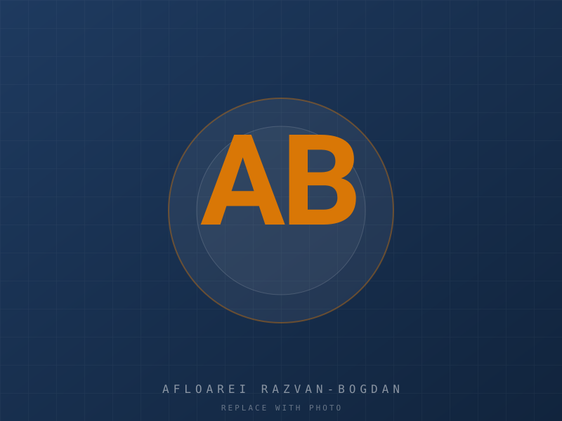

# Portfolio v2.0 — Afloarei Razvan-Bogdan

Premium engineering portfolio — geodetic engineering, infrastructure design, AI automation.

**Live site:** https://ARazvan99.github.io
**LinkedIn:** https://www.linkedin.com/in/razvan-afloarei/

---

## About PNRR

PNRR (Romanian: *Planul Național de Redresare și Reziliență*) is Romania's national plan implementing the **EU Recovery and Resilience Facility (RRF)** — the main financial instrument of **NextGenerationEU**, the European Union's COVID-19 economic-recovery programme. PNRR projects are funded by the EU through the RRF and disbursed to Romania for investments and reforms.

---

## Stack

- Plain HTML, CSS, vanilla JavaScript — **no build tools, no frameworks, no CDN**.
- 4 languages with a dropdown selector: **English · Română · Français · Deutsch** (preference saved in `localStorage`).
- Self-contained, mobile-first, AA contrast, keyboard-usable.
- Schema.org JSON-LD, Open Graph + Twitter Card, canonical URLs.
- GitHub Pages hosted.

## File structure

```
.
├── index.html                    # main page, 17+ sections
├── project-1.html … project-6.html   # premium per-project pages
├── cv.html                       # printable CV
├── style.css                     # design system (~95 KB)
├── script.js                     # 4-language i18n + UI (~115 KB)
├── README.md
├── assets/
│   ├── flags/
│   │   ├── gb.svg                # English
│   │   ├── ro.svg                # Română
│   │   ├── fr.svg                # Français
│   │   └── de.svg                # Deutsch
│   ├── dividers/
│   │   ├── ruler.svg
│   │   └── compass.svg
│   └── badges/
│       └── eu-funded.svg
└── images/
    ├── photo-placeholder.svg     # hero photo placeholder
    ├── drawing1.svg … drawing6.svg   # hero images per project
    └── projects/
        ├── p1/  01-plan.svg  02-section.svg  03-detail.svg
        ├── p2/  …
        ├── p3/  …
        ├── p4/  …
        ├── p5/  …
        └── p6/  …
```

## Sections

`index.html` contains the following sections, in order:

1. **Sticky Nav** — brand mark, language dropdown, LinkedIn/GitHub, mobile menu
2. **Hero** — new headline, photo placeholder, 6 CTAs, trust strip
3. **Stats bar** — 4 animated counters (years, projects, industries, EU-funded)
4. **Why me?** — 16-card trust grid
5. **About** — 4 paragraphs (preserved v1 content + expanded)
6. **Services** — 4 grouped categories × 4-5 services = 19 services
7. **Specializations** — 17 deep technical chips
8. **Technologies** — 3 categories: Engineering software / Survey equipment / Digital skills
9. **Skills** — 11 grouped competency cards
10. **Industries** — 16 industry chips
11. **Work philosophy** — 10 values with icons
12. **AI & Automation** — 11 capability cards
13. **Career timeline** — 6-stop interactive timeline
14. **Certifications** — designed for future additions
15. **International availability** — 8 modes
16. **Languages** — 3 proficiency cards with bars and flags
17. **Portfolio** — gallery with tech chips per card → project pages
18. **Contact** — premium with location, availability, response time, LinkedIn, GitHub
19. **Footer** — motto, quick links, social, response time

## Editing content

All copy lives in **two places**:

1. **English default text** is in each HTML file (`index.html`, `project-N.html`, `cv.html`). Each translatable element has a `data-i18n="..."` attribute.
2. **Translations** (EN / RO / FR / DE) live in the `I18N` object at the top of `script.js`.

To change a sentence:
1. Find the matching key in the HTML file (e.g. `data-i18n="about.p2"` or `data-i18n="project1.overview"`).
2. Update the English text in the element.
3. Update the same key in **all 4** language sections (`en`, `ro`, `fr`, `de`) in `script.js`.

The project overview / problem / solution / impact / lessons / deliverables text is currently marked `[PLACEHOLDER ...]` — replace it with your real content when you have the projects.

## Replacing a placeholder image

### Hero photo

Drop your portrait at `images/photo.jpg` (or `.png`). Then in `index.html`, change:
```html

```
to:
```html

```

### Project hero (drawing 1–6)

Each project's hero image lives in `images/` as `drawingN.svg`. Replace with your real export (same filename, or update `src`/`href` in `project-N.html`).

### Project gallery (per-project placeholder slots)

Each project has 3 image slots in `images/projects/pN/`:
- `01-plan.svg`
- `02-section.svg`
- `03-detail.svg`

Drop your real exports into that folder. Same filenames — no HTML edits needed.

## Adding a new project

1. Copy any `project-N.html` to `project-N+1.html` and rename.
2. Update inside the new file:
   - `<title>` and `<meta description>`
   - The eyebrow number (`Project 0N+1`)
   - The hero `` and `<a href="images/drawingN+1.svg">`
   - Every `data-i18n="projectN+1.*"` reference
   - The three gallery `` paths
   - The Prev/Next links (don't forget to update the neighbour pages too)
3. Create the folder `images/projects/pN+1/` and copy in the 3 placeholder SVGs (or your own exports).
4. Add `drawingN+1.svg` in `images/` (or use an existing one).
5. Add a new gallery `<li>` in `index.html` with `href="project-N+1.html"`.
6. Add the matching `projectN+1.*` keys to **all 4** language sections in `script.js` (`en`, `ro`, `fr`, `de`).

## Adding a certification

Edit `script.js` and add a new cert card structure to each language's `certs.*` keys, then add a corresponding `<div class="cert-card">…</div>` block to the `#certs` section in `index.html`.

## Language dropdown

The dropdown is in the nav bar. Each option shows a country flag + language name in native script. Click outside or press `Escape` to close. Selection persists in `localStorage`. Browser-language detection also kicks in on first visit.

To change display labels, edit the `LANG_NAMES` object in `script.js`.

## Local preview

You don't need anything installed. Just double-click `index.html` and it opens in your browser.

For a local server:

```bash
# Python
python -m http.server 8000
# or Node
npx serve .
```

Then open http://localhost:8000

## Publishing (already done)

The site is hosted by GitHub Pages from the `main` branch, root directory.

To republish after changes:

```bash
git add .
git commit -m "Update portfolio"
git push
```

GitHub Pages will rebuild automatically within ~1 minute.

## Contact

**Afloarei Razvan-Bogdan**
- Email: afloareirazvan@yahoo.com
- Phone: +40 768 981 416
- LinkedIn: https://www.linkedin.com/in/razvan-afloarei/
- GitHub: https://github.com/ARazvan99